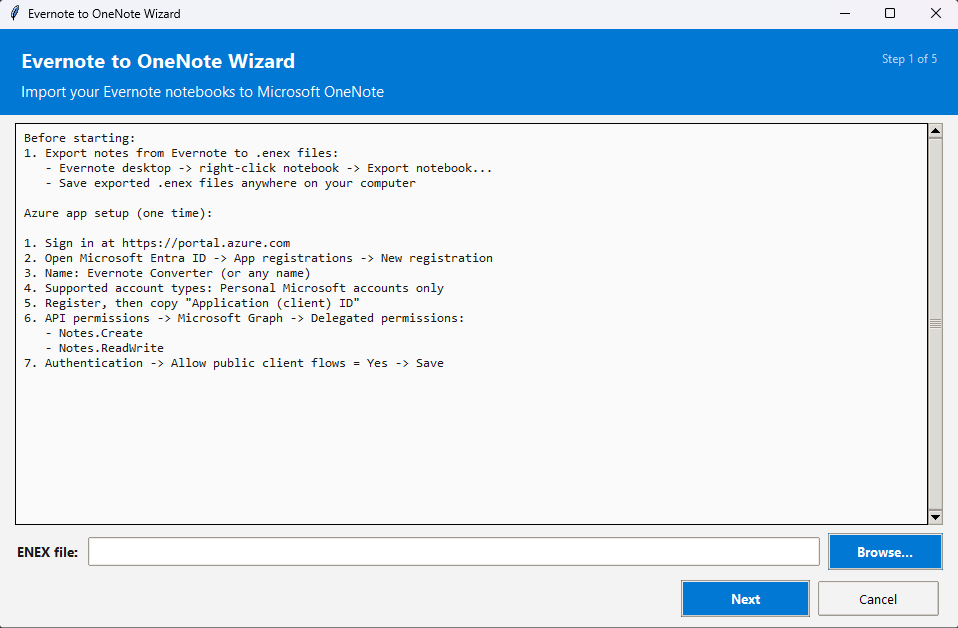

# Evernote to OneNote Converter

Import Evernote `.enex` export files into Microsoft OneNote (personal Microsoft account) using Microsoft Graph API.

## App Screenshot



## How It Maps

| Evernote | OneNote |
|----------|---------|
| All selected `.enex` files | One notebook |
| One `.enex` file | One section |
| One note | One page |
| Image resources | Inline images |
| File resources | Embedded attachments |

## Choose Your Path

| User Type | Best For | Effort | Difficulty |
|----------|----------|--------|------------|
| General User (Windows only, Recommended) | No Python knowledge, just want the app | ~5-10 min | ★☆☆☆☆ |
| Advanced User (Windows only, Pro Only) | Build your own `.exe` with custom env | ~10-20 min | ★★★☆☆ |
| Developer | Run/modify source code | ~10 min | ★★★★☆ |

Note: `General User` and `Advanced User` paths are Windows-only.  
If you are on macOS/Linux, use the `Developer` path.

## General Users (Recommended)

Windows only.

No prebuilt `.exe` is distributed. You build it locally with one double-click script.

1. Open this GitHub repository page in your browser:
   https://github.com/yiluzhou/Evernote_converter
2. Click the green **Code** button.
3. Click **Download ZIP**.
4. Open your **Downloads** folder.
5. Right-click the downloaded ZIP file, then click **Extract All...**.
6. Open the extracted project folder.
7. In the project main folder, double-click `Build_EvernoteToOneNoteWizard.bat`.
8. After build completes, double-click `EvernoteToOneNoteWizard.exe` in the same main folder.

Notes:
- The builder script creates a local env (`.build_env`) automatically.
- If Python is missing, it automatically downloads and installs Python 3.14 into project-local folder `.python_runtime`.
- It installs build dependencies only inside `.build_env` (not system Python / not your conda envs).
- Internet connection is required for first-time auto bootstrap.
- If an update is detected, the app opens the repository homepage only.
- No installer/uninstaller is required.

## Advanced Users (Pro Only): Build the Windows App Yourself

Windows only.

No prebuilt `.exe` is distributed. Advanced users also build locally.

Use any one environment workflow below.
Then run `Build_EvernoteToOneNoteWizard_Advanced.bat` from the project main folder.

Output (same for all options):
- `EvernoteToOneNoteWizard.exe` in the project main folder

### Option A: conda

```bash
conda create -n evernote python=3.14 -y
conda activate evernote
pip install -r requirements.txt pyinstaller
Build_EvernoteToOneNoteWizard_Advanced.bat
```

### Option B: venv

```bash
python -m venv .venv
.venv\Scripts\activate
pip install -r requirements.txt pyinstaller
Build_EvernoteToOneNoteWizard_Advanced.bat
```

### Option C: uv

```bash
uv venv --python 3.14
.venv\Scripts\activate
uv pip install -r requirements.txt pyinstaller
Build_EvernoteToOneNoteWizard_Advanced.bat
```

## Developers: Run from Source

Cross-platform (Windows/macOS/Linux).

Set up a Python environment first, then run from source.

Option A (venv):

```bash
python -m venv .venv
.venv\Scripts\activate
pip install -r requirements.txt
python src/main.py
```

Option B (conda):

```bash
conda create -n evernote-dev python=3.14 -y
conda activate evernote-dev
pip install -r requirements.txt
python src/main.py
```

Option C (uv):

```bash
uv venv --python 3.14
.venv\Scripts\activate
uv pip install -r requirements.txt
python src/main.py
```

## One-Time Azure Setup (About 5 Minutes)

The wizard includes the full step-by-step Azure checklist in-app.

Required settings:
1. Supported account type: Personal Microsoft accounts only
2. Delegated Graph permissions: `Notes.Create`, `Notes.ReadWrite`
3. Authentication: `Allow public client flows = Yes`

If setup is incorrect, the app detects common failure reasons (invalid client ID, missing permissions, public client flow disabled, consent issues) and shows a copyable ChatGPT prompt for screenshot-based help.

## Usage

Launch one of the following:
1. `EvernoteToOneNoteWizard.exe` (general/advanced users)
2. `python src/main.py` (developers)

Advanced CLI mode (pro only):

```bash
python src/main.py --advanced --enex-dir enex/ --notebook-name "Evernote Import" --client-id YOUR_CLIENT_ID
```

## Duplicate Handling

- Notebook/section deletion is never automatic.
- If using an existing notebook, the app shows the notebook web link and asks you to manage cleanup manually.
- Duplicate identity is GUID-first:
  - Primary: embedded Evernote GUID in existing OneNote page metadata
  - Fallback: normalized title + created timestamp (for older pages without GUID)
- For each duplicate, detailed page info and web link are shown.
- Choices: `replace`, `replace all`, `skip`, `skip all`.

## Find Uploaded Notebook

1. OneDrive Documents: https://onedrive.live.com/
2. OneNote web: https://www.onenote.com/notebooks
3. Verify by API:

```bash
python scripts/check_notebooks.py
```

## Project Structure

```
Build_EvernoteToOneNoteWizard.bat  # Double-click builder for general users
Build_EvernoteToOneNoteWizard_Advanced.bat  # Root-level advanced builder
src/
  enex_parser.py
  onenote_uploader.py
  gui_wizard.py
  update_checker.py
  main.py
scripts/
  check_notebooks.py
  build_windows_exe.bat
  run_wizard.bat
tests/
  test_enex_parser.py
  test_onenote_uploader.py
  test_update_checker.py
  test_main.py
```

## License Notes

See `THIRD_PARTY_LICENSES.md` for dependency and build-tool license notes.
